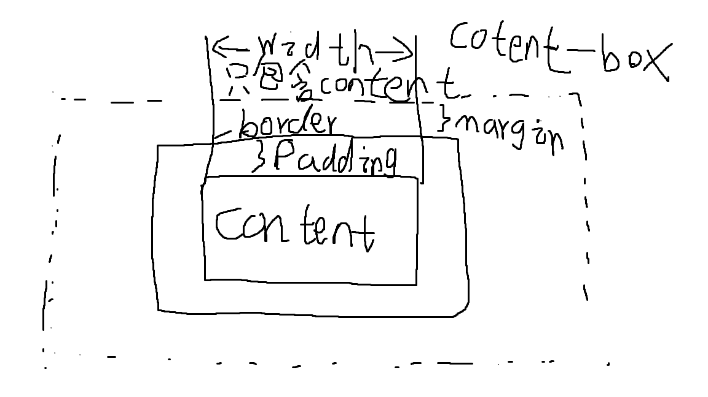
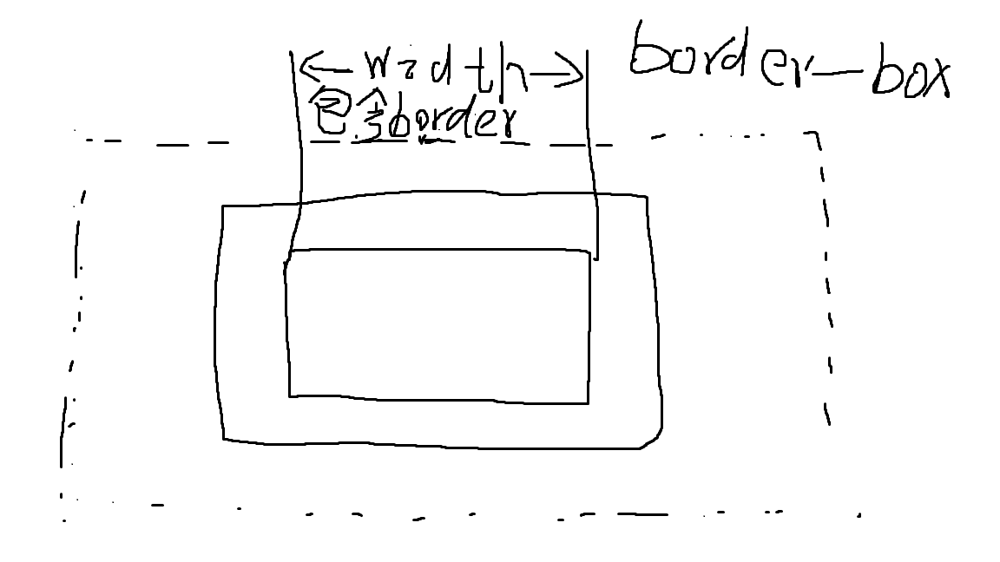

# CSS 盒模型

## CSS 盒模型有两种一种是 content-box 和 border-box

### content-box

content-box 又称内容盒模型，内容就是盒子的边界宽度，只包含内容(content)

### border-box

border-box 又称边框盒模型，边框就是盒子的边距，宽度包含内容(content),内边距(padding),和边框(border) border-box 的宽度是你设置多少就是多少

相对来说 border-box 好用 因为可以同时指定 padding,content,border 的宽度 如果不指定 padding,content,border 的宽度 content-box 和 border-box 肉眼观察就没有区别
